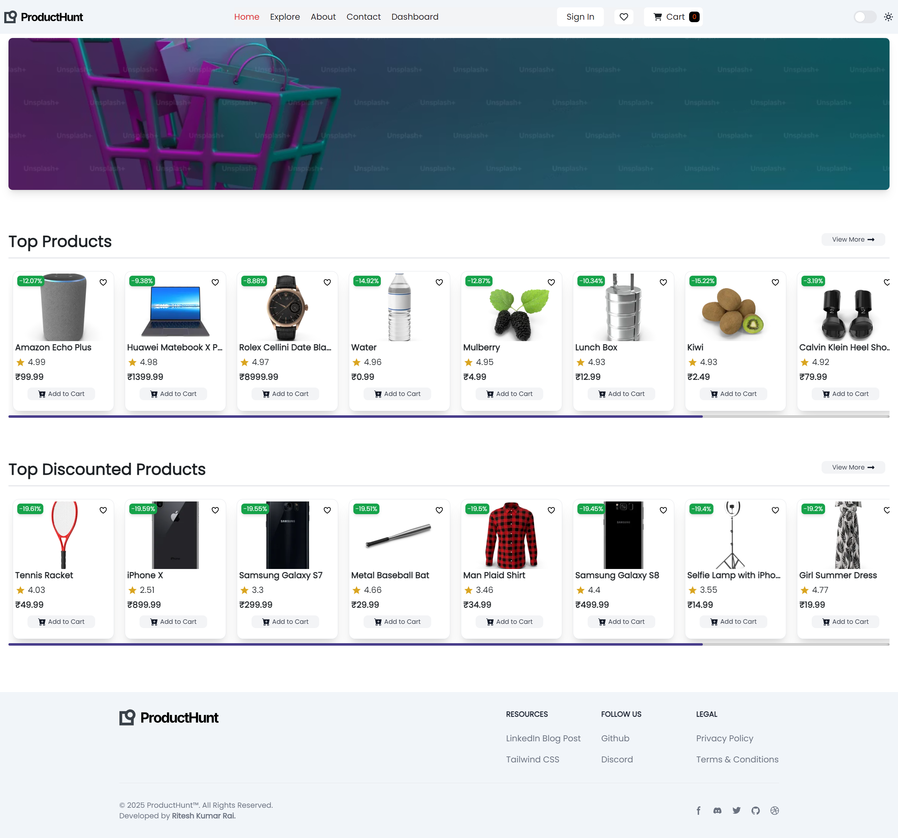
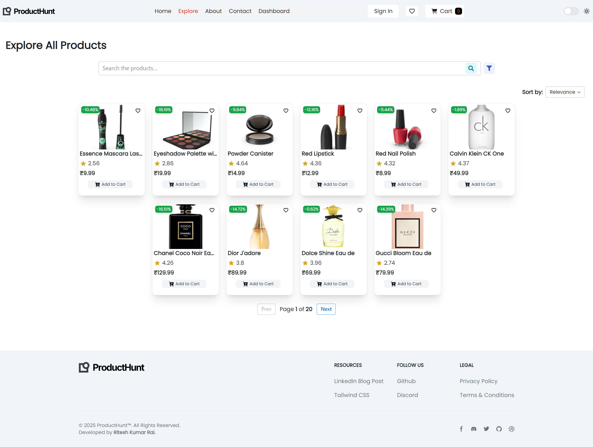
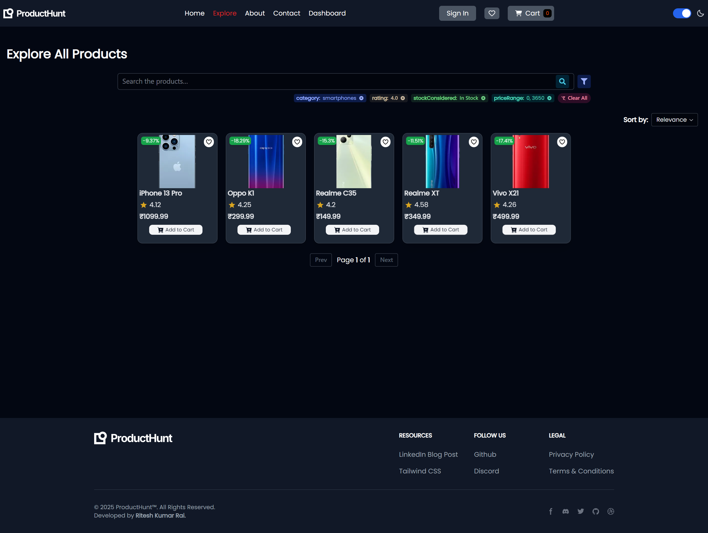
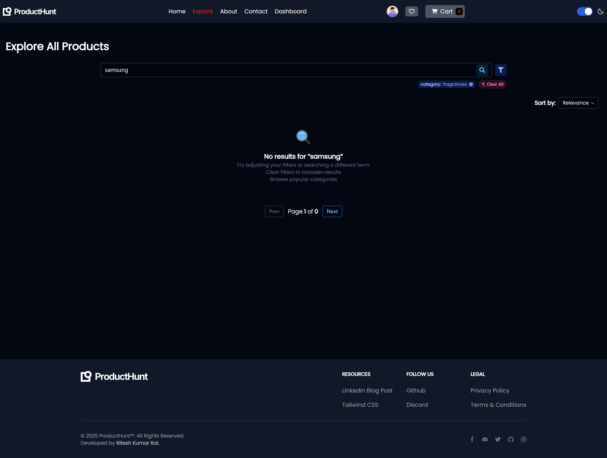
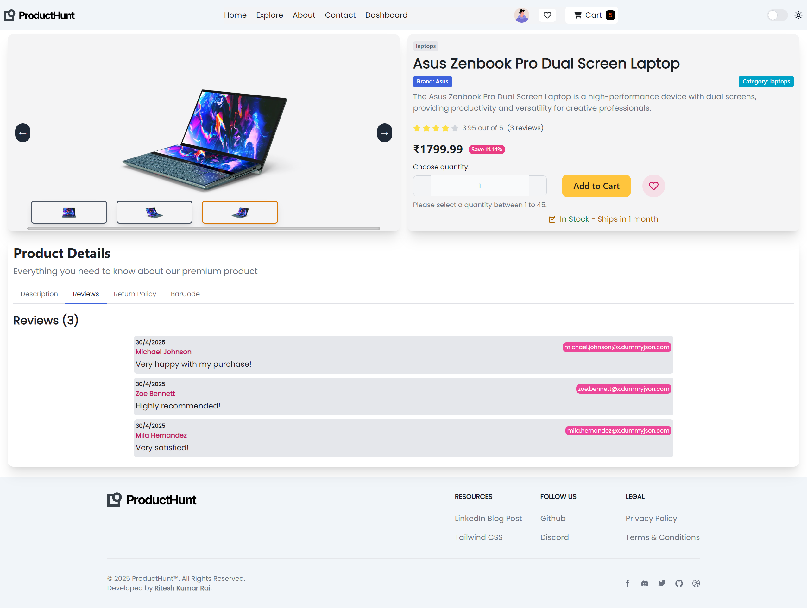
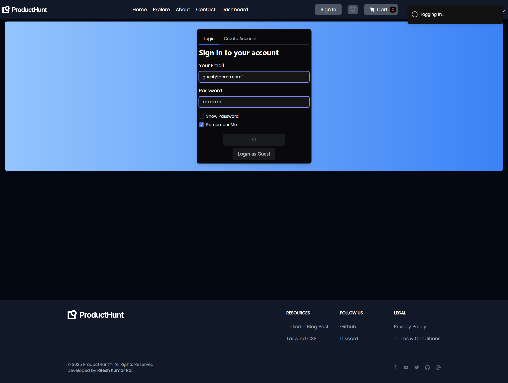
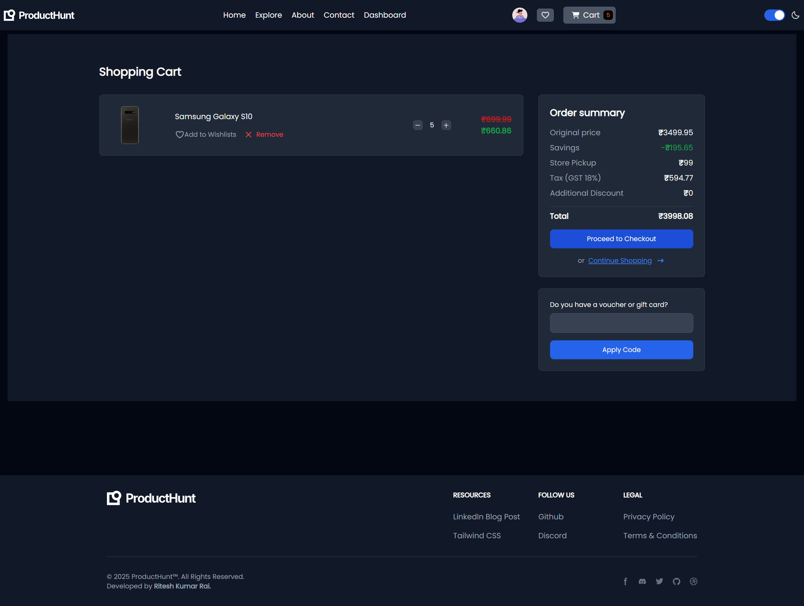
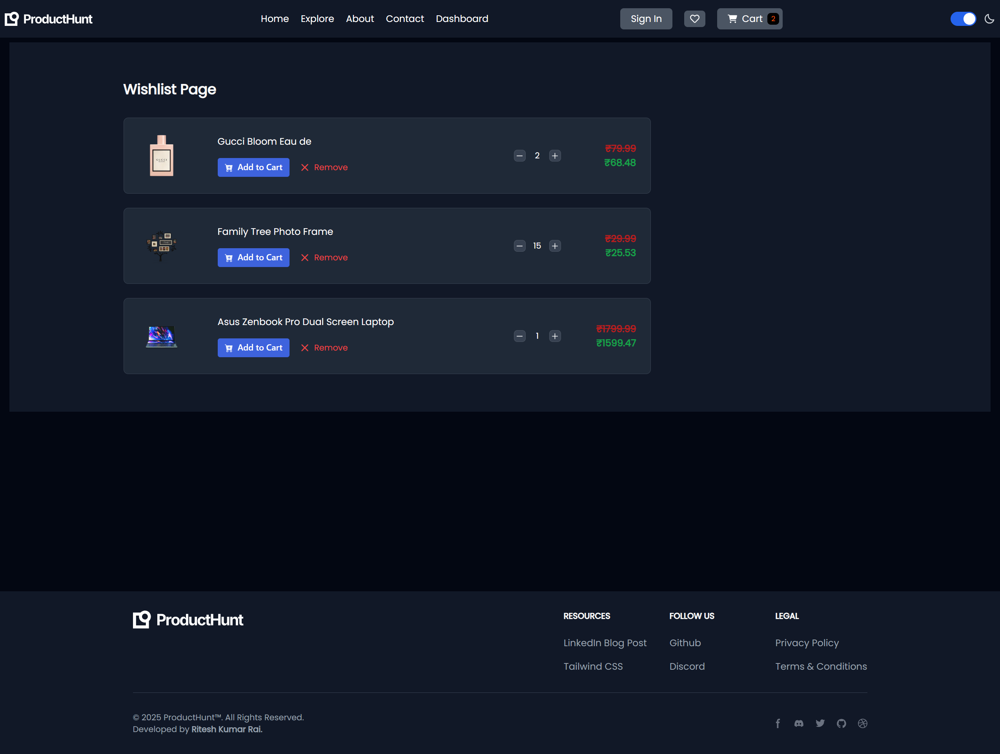
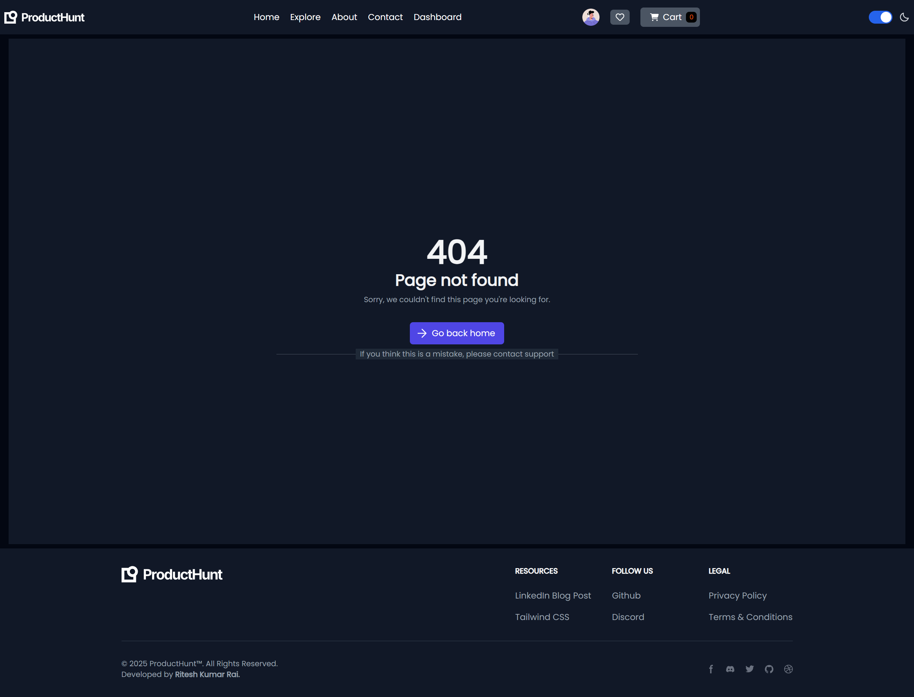
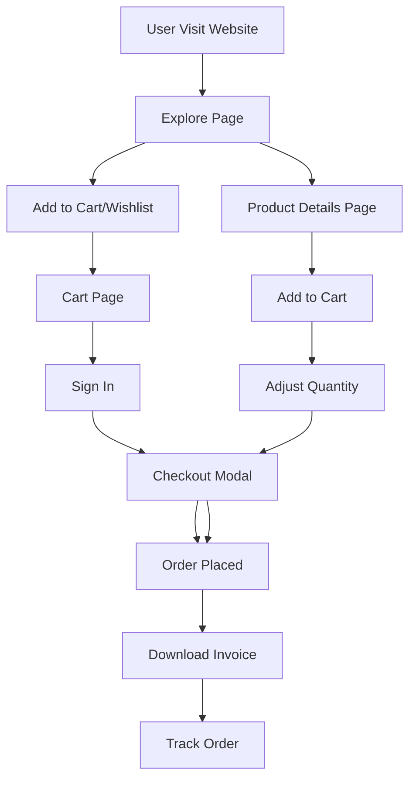

# 🚀ProductHunt - E-commerce frontend only Project

🔗 [Live Demo](https://product-hunt-react.vercel.app)  
📦 Frontend-only simulation of a scalable e-commerce platform.

## About

The ProductHunt is an e-commerce frontend webapp, build using React, Tailwind CSS, RadixUI, React Router. Powered by Context API & Reducer for Strong State Management.

## ✨ Features

- Browse products with category and various filters & search
- Add/remove items from cart or wishlist with dynamic quantity management
- Responsive design for mobile and desktop
- Context API + Reducer for state management
- Used API for Dynamic Products fetching & Simulated product data via `products.json`
- Frontend level Complete Authentication System
- Light/Dark Theme Mode
- Guest Login Option (for testers)

## ⚙️ Getting Started

### 1. Clone the repository

```bash
git clone https://github.com/Ritesh-Kumar-Rai/ProductHunt_React.git
cd producthunt
```

### 2. Install dependencies

```bash
npm install
```

### 3. Then run the project

```cmd
npm start
```

### 4. Build for production

```cmd
npm run build
```

## 🚀 Tech Stack Used

- **JavaScript**
- **React Js**
- **Tailwind CSS**
- **Radix UI**
- **React-Router**

### Not Included:

Redux, RTK or Zustand is not included in this project, because i am testing how Context+Reducer extends to, and when this project actually demands for Advanced State management. Till now all are quiet done smoothly with Context & Reducer;

## 📸 Screenshots

### Homepage



### Explore Page



### Explore Page Searching & Filtering result



### Explore Page Error Handling



### Products Details Page



### Authentication Page



### Cart Page



### Wishlist Page



### 404 Not Found Page



#### Demo video

🎥 Watch the full demo on [LinkedIn](https://www.linkedin.com/posts/ritesh-kumar-rai-bb6901296_learninpublic-webdev-ecommerce-activity-7396935135037878272-zQSt?utm_source=share&utm_medium=member_desktop&rcm=ACoAAEeuWXoBZGm1lXRgekFYbxupflEu8HA5hyA)

## 📂 Project Structure

```js
producthunt/
└── src/
    ├── assets/                 # Static assets (images, icons, styles)
    ├── components/             # Reusable UI components
    │   ├── filters/            # Filtering & searching feature components
    │   └── shared/             # Shared components (Error404Page, ErrorBoundary, route guards)
    │   └── ...                 # Other UI components
    ├── constants/              # Static data/constants
    │   └── products.json       # Product data (bandwidth optimization)
    ├── context/                # Global state management (Context + Reducer)
    │   ├── AuthContext.jsx     # Authentication state
    │   ├── FilterContext.jsx   # Filtering state
    │   └── ProductContext.jsx  # Product/cart/wishlist state
    ├── hooks/                  # Custom React hooks
    │   └── useAuthManager.js   # Authentication logic hook
    ├── pages/                  # Page-level views
    │   ├── ContactPage.jsx
    │   ├── Explore.jsx
    │   ├── Home.jsx
    │   ├── Product.jsx
    │   ├── ShoppingCartPage.jsx
    │   ├── Signin.jsx
    │   └── WishlistPage.jsx
    ├── store/                  # Reducer-based store
    │   └── productStore.js
    └── utils/                  # Utility functions/classes
        └── Utility.js
```

## 📊 Data Flow Diagram (DFD)



### Todo/Issues:

- In product page even the product is out of stock and total stock is zero, the user still able to add it to cart. It's a bug.

- In Explore page the Search Bar doesn't have clear/remove btn or option, will see later; & un-expectedly the explore component was re-rendering for more than 7 times which is a bottleneck of performance.. will see in future too.

- In Product.jsx page in reviews section nested-reviews are remained to work on it and display all of them. Will see that also in future.

- The Cart and Wishlist products are getting wiped when page refreshed... needed to store in localStorage or atleast sessionStorage.

### Fixed:

- The problem with Explore.jsx page re-rendering multiple times was fixed by implementing memoisation and optimisation techniques.

## 📑 Features Documentation

Additional case studies and detailed explanations for:

- Authentication System
- Searching, Filtering & Sorting

These can be found in the `Features Documentation` folder in the root repo.

## LICENSE

[MIT License](LICENSE)

## 👨‍💻 Author

- **Ritesh Kumar Rai**
- [LinkedIn](https://in.linkedin.com/in/ritesh-kumar-rai-bb6901296)
- [GitHub](https://github.com/Ritesh-Kumar-Rai)
